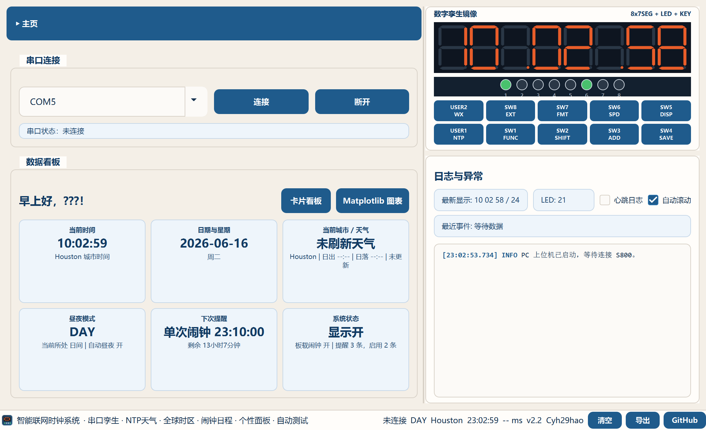
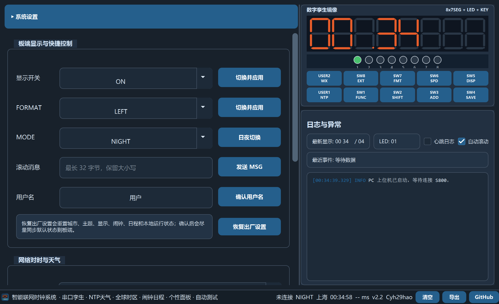
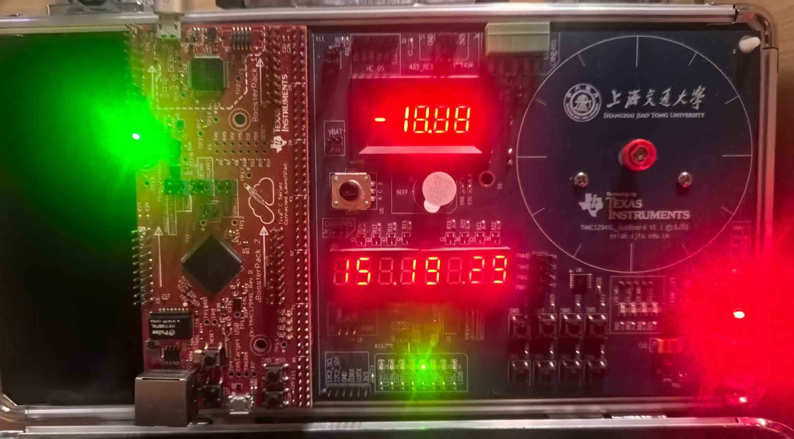
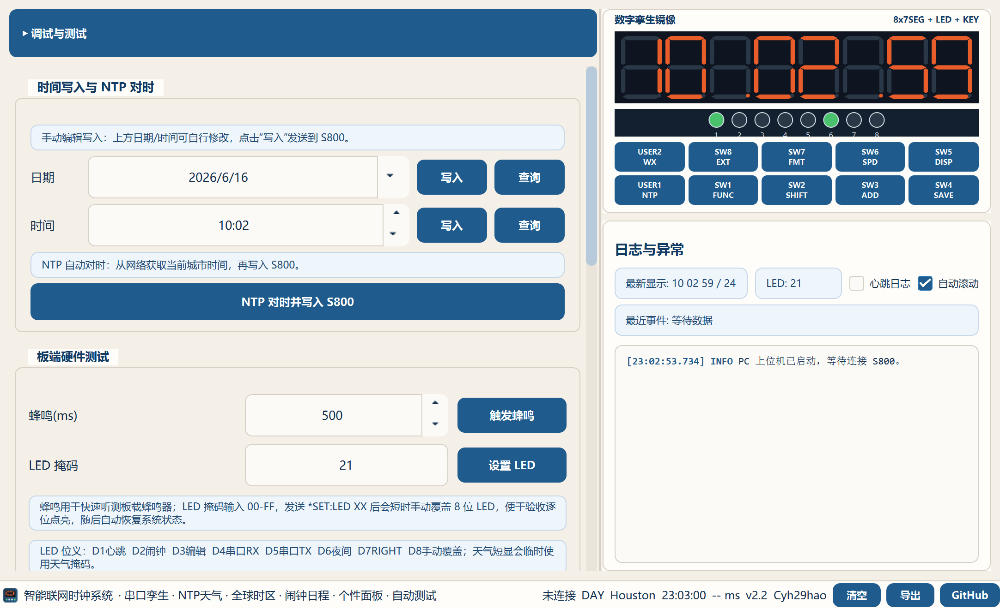
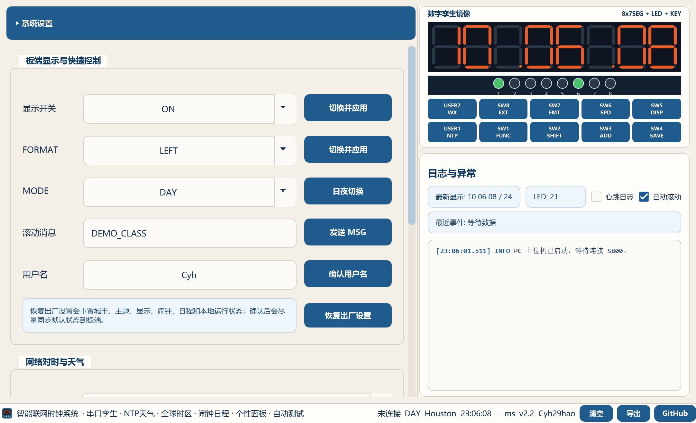
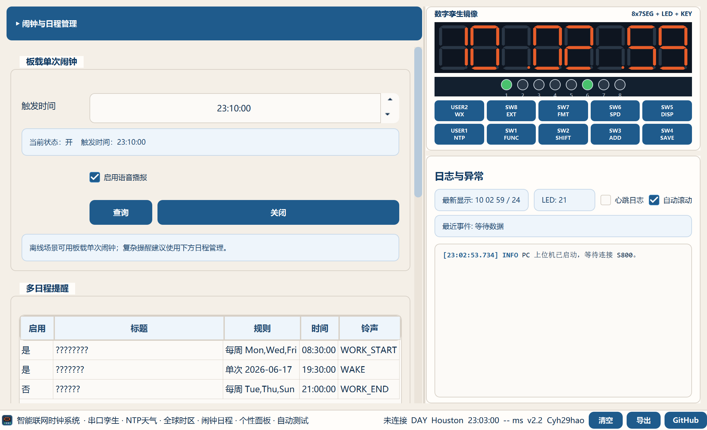
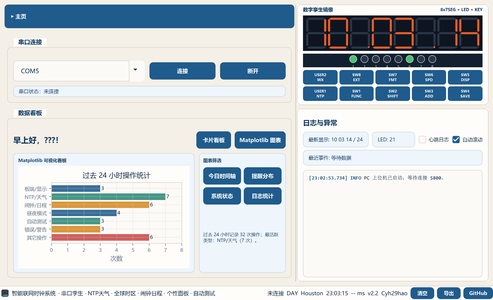

<link rel="stylesheet" href="pdf_report_style.css">

# 智能联网时钟系统大作业实验报告

<p class="meta">学生：陈云海　　学号：524031910102　　版本：v2.2</p>
<p class="meta">项目仓库：<a href="https://github.com/Cyh29hao/qianrushidazuoye">Cyh29hao/qianrushidazuoye</a></p>

<div class="abstract">

<p><strong>摘要：</strong> 本项目实现了一套由 S800/TM4C1294 板端和 Python/PyQt5 PC 上位机构成的智能联网数字时钟系统。板端负责数码管、LED、按键、蜂鸣器、闹钟、时间日期和串口协议，能够脱离 PC 独立运行；PC 端负责串口连接、数字孪生镜像、网络对时、全球时区、天气短显、自动昼夜、日程提醒、Matplotlib 数据看板和自动化测试。两端通过 115200 8N1 ASCII 串口协议协同，PC 下发 <code>SET/GET/PING</code> 等命令，MCU 返回 <code>OK/ERROR/PONG</code> 并主动上报 <code>EVT</code> 显示帧、LED、按键、模式和闹钟事件。最终交付内容包括可烧录 MCU 工程、可双击运行的 Windows 上位机 v2.2、README、验收对照、测试记录、演示视频和本实验报告。</p>

</div>

<div class="toc">

<p class="no-indent"><strong>报告索引</strong></p>

<p class="no-indent">
<a href="#1-系统组成与使用流程">1. 系统组成与使用流程</a>　　
<a href="#2-课程要求覆盖与创新点">2. 课程要求覆盖与创新点</a>　　
<a href="#3-总体架构与串口协议">3. 总体架构与串口协议</a>　　
<a href="#4-s800tm4c1294-板端设计">4. S800/TM4C1294 板端设计</a>
</p>

<p class="no-indent">
<a href="#5-pc-上位机设计">5. PC 上位机设计</a>　　
<a href="#6-联网扩展与数据可视化">6. 联网扩展与数据可视化</a>　　
<a href="#7-测试验证与稳定性设计">7. 测试验证与稳定性设计</a>
</p>

</div>


<p class="caption">图1：PC 上位机主页、右侧数字孪生镜像与虚拟按键悬停提示。</p>

<div class="page"></div>

## 1. 系统组成与使用流程

　　本系统可以理解为“板端数字时钟 + PC 联网增强 + 串口双向同步”三部分。S800/TM4C1294 板端承担实时性要求较高的本地显示和硬件控制，PC 上位机承担更适合桌面端完成的联网、配置、日志、图表和自动测试。串口连接后，PC 端右侧数字孪生镜像以板端真实 `*EVT:DISP` 和 `*EVT:LED` 帧为准刷新，能够把实物数码管、LED 和按键状态直观展示出来。

　　实际使用时，先用 Keil5 打开 `mcu/clock.uvprojx` 并烧录 S800 板；工程 Output 页已勾选 `Create HEX File`，输出名为 `s800_clock`，提交包保留 `mcu/obj/s800_clock.axf` 和 `s800_clock.hex`。板端 RESET 后依次显示全亮/全灭、学号后八位、姓名拼音、版本号和默认时钟页。然后双击 `SmartClockHost-v2.2.exe` 或运行源码版 `launch.bat`，在 PC 上选择 COM5 等串口并连接。连接成功后，PC 会自动执行一次网络对时并写入板端；网络不可用时使用当前城市/PC 本机时间兜底。若不连接串口，PC 也可进入离线演示模式，用于展示界面、配置和图表。

　　主页由串口连接、数据看板、数字孪生镜像和日志区组成。左侧看板展示当前时间、日期、天气、昼夜模式、下次提醒和系统状态；右侧固定显示 8 位七段数码管、8 位 LED、SW1-SW8、USER1/USER2 和日志摘要。图1中的悬停提示用于说明每个虚拟按键的实际功能，方便老师在第一次打开程序时理解按钮语义。


<p class="caption">图2：黑夜模式下的主页，右侧镜像仍完整显示数码管、LED、按键和日志。</p>


<p class="caption">图3：S800/TM4C1294 实物板运行效果，包含主控板、8 位数码管、LED、蜂鸣器和按键区。</p>

<div class="page"></div>

## 2. 课程要求覆盖与创新点

　　本项目覆盖课程要求中的 S800 本地时钟、PC 上位机、串口协议、数字孪生和扩展功能，并在此基础上加入多项自主设计。基础功能侧重“板端离线可运行”，扩展功能侧重“PC 联网增强”，自主增加功能侧重“展示体验、可测试性和鲁棒性”。

| 分类 | 课程/项目要求 | 本项目实现情况 |
| --- | --- | --- |
| S800 基础时钟 | 开机画面、时间/日期/星期/年份、闹钟、按键编辑、LED、蜂鸣。 | `mcu/src/main.c` 实现时钟推进、显示扫描、按键状态机、蜂鸣和 LED 位义。 |
| PC 上位机 | 串口扫描、控制面板、日志、状态栏和数字孪生。 | PyQt5 上位机分为主页、系统设置、闹钟与日程管理、调试与测试四模块。 |
| 串口协议 | `SET/GET/PING/EVT/ERROR`、容错、错误分类、RIGHT 格式。 | 支持大小写容错、空格容错、合法缩写、`ERROR LEN/SYNTAX/PARAM/RANGE`。 |
| 扩展功能 | 网络对时、天气、自动昼夜、数据可视化。 | NTP/天气/全球时区、USER2 天气短显、自动昼夜和 Matplotlib 图表看板均已实现。 |
| **自主增加功能** | 至少 1 项原创功能。 | **多日程提醒、全球时区、两套自动测试脚本、高并发防卡死、PC/板端双向昼夜控制、GitHub 版本管理与打包 release。** |

　　其中比较适合重点展示的创新点有四类。第一，**全球时区 + NTP 天气**：输入城市或国家后自动定位到城市/首都，获得经纬度、IANA 时区和天气信息，再按当地时间写入板端。第二，**自动昼夜与双向控制**：PC 可根据当前城市时间自动决定 DAY/NIGHT，板端长按 USER1 也能反向切换 PC 主题。第三，**自动测试与高并发防卡死**：快速/全面两套脚本覆盖协议、按键、USER2、跑马灯、错误格式和高并发场景，测试期间屏蔽人为串口干扰。第四，**产品化界面**：数字孪生、日志、图表、悬停提示和打包 exe 让系统不只是能跑代码，而是能清楚展示和交付。


<p class="caption">图4：系统设置中的板端显示消息入口，可向 S800 下发滚动消息并同步到数字孪生。</p>

<div class="page"></div>

## 3. 总体架构与串口协议

　　系统采用分层协同结构：MCU 端负责 1 ms 时基、动态数码管、按键防抖、蜂鸣、LED、时钟状态机和串口解析；PC 端负责界面、串口调度、NTP、天气、时区、日程、Matplotlib 和自动测试。这样可以保证板端离线时仍能作为数字时钟运行，PC 网络请求或图表刷新也不会阻塞板端显示。

| 层次 | 主要职责 | 协同方式 |
| --- | --- | --- |
| PC UI | 页面、按钮、日志、数字孪生、Matplotlib 图表 | 用户操作转为串口命令，板端事件刷新界面。 |
| PC 后台服务 | NTP、天气、时区、日程、自动测试 | 使用 timeout、任务 token 和串口安静窗口，避免插队和卡死。 |
| 串口协议 | 115200 8N1 ASCII 文本帧 | PC 发 `SET/GET/PING`，MCU 回 `OK/ERROR/PONG/EVT`。 |
| MCU 主循环 | 时钟、显示、按键、蜂鸣、协议解析 | 非阻塞推进，并主动上报显示和状态。 |
| S800 外设 | 数码管、LED、按键、蜂鸣器 | MCU 直接驱动，保证离线可用。 |

<div class="flow">
<span><b>PC 上位机</b>配置、日志、图表、测试</span>
<span><b>串口协议</b>SET / GET / PING / EVT</span>
<span><b>MCU 主循环</b>时间、按键、显示、蜂鸣</span>
<span><b>S800 外设</b>7SEG、LED、KEY、BEEP</span>
</div>
<p class="caption">图5：系统分层协同关系，PC 做联网增强，MCU 保证板端实时运行。</p>

　　串口帧以 `*` 开头，兼容 `\r`、`\n` 和 `\r\n` 行结束符。合法命令返回 `OK` 或 `OK <payload>`，心跳返回 `*PONG <seconds>`，显示变化和按键事件通过 `*EVT:*` 主动上报，非法输入统一返回 `ERROR <reason>`。PC 的协议测试台和自动测试脚本均按同一规则判断结果。

```text
*PING
*SET:DATE YEAR MONTH DATE 2026 06 17
*SET:TIME HOUR MIN SEC 12 30 45
*SET:FORMAT RIGHT
*EVT:DISP __540321 28
ERROR PARAM
```

　　协议容错遵循“常用缩写可接受，歧义缩写不放行”的原则。例如 `MINUTE -> MIN`、`SECOND -> SEC`、`DISPLAY -> DISP` 可接受；`MONTH` 和 `FORMAT` 保持全称，避免 `MON`、`FOR` 与其他字段产生歧义。老师最新版 FAQ v1.3 对 `*EVT:DISP` 作了更明确要求：8 字符不包含小数点，空位用 `_`，`dpHex` 的 bit0 对应最左 digit。因此 `12.30.45` 在 LEFT 下上报 `123045__ 0A`，RIGHT 下上报 `__540321 28`。老师测试中故意构造的非法命令会返回 `ERROR`，这属于正确拒绝，而不是通信失败。

<div class="page"></div>

## 4. S800/TM4C1294 板端设计

　　板端主逻辑集中在 `mcu/src/main.c`。程序启动后初始化时钟、SysTick、UART、I2C、按键、LED 和蜂鸣器，然后进入主循环。SysTick 只做轻量计数，主循环按 10 ms、100 ms、500 ms、1000 ms 等节拍处理显示、按键、蜂鸣、时间推进和串口输入，避免长时间阻塞导致数码管停刷或串口无响应。

　　显示方面，默认时间页为 `HH.MM.SS`；DISP 短按循环时间、日期、星期和年份；FORMAT 切换 LEFT/RIGHT 流水方向；SPEED 切换滚动速度；长文本和星期页通过跑马灯状态机显示。NIGHT 普通时间页显示时分，降低夜间信息密度；进入 FUNC 时间编辑页时仍显示完整时分秒，便于准确调整。跑马灯在端点停顿，结束时最后一帧额外停留后恢复正常时间页。

　　按键方面，FUNC、SHIFT、ADD、SAVE 组成日期/时间/闹钟编辑状态机；EXT 用于退出临时显示、编辑态或关闭板载单次闹钟；USER1 短按请求 PC 对时，长按切换 DAY/NIGHT；USER2 定义为天气短显。板端物理按键和 PC 虚拟按键采用尽量一致的语义，并设置防抖、节流和超时退出，避免连续按键把状态机压死。

　　LED 位义固定为：D1 心跳、D2 闹钟、D3 编辑、D4 串口 RX、D5 串口 TX、D6 夜间、D7 RIGHT、D8 NTP 同步状态。天气短显或 LED 掩码接管时会临时覆盖整组 LED，结束后恢复系统位义。蜂鸣器用于板载闹钟、PC 日程提醒、手动蜂鸣测试和铃声预览。板端还保存最近时间，RESET 后优先从最近保存时间恢复，PC 连接后再由 NTP 或 PC 时间覆盖，避免每次复位都回到默认时间。


<p class="caption">图6：调试与测试页中的蜂鸣、LED 掩码和 D1-D8 位义说明。</p>

　　老师提醒提交时需要检查 Keil `Create HEX File` 选项。本项目在 `mcu/clock.uvprojx` 中已经设置 `OutputName=s800_clock`、`CreateExecutable=1`、`CreateHexFile=1`，因此 Keil 编译后会同时生成 axf 与 hex，评测时可以直接使用 `mcu/obj/s800_clock.hex` 烧录。为保证提交包和源码一致，凡是修改 `mcu/src/main.c` 后都需要重新编译刷新这两个文件。

<div class="page"></div>

## 5. PC 上位机设计

　　PC 上位机采用 PyQt5 实现，主窗口分为左侧功能区、右侧数字孪生镜像和底部状态栏。左侧功能区包括 **主页、系统设置、闹钟与日程管理、调试与测试** 四个模块；右侧固定展示数码管、LED、虚拟按键和日志摘要。界面同时适配白天/黑夜模式，避免黑夜模式白底、控件裁切、标题压线和横向滚动。

　　系统设置页负责全局配置，包括用户名、DAY/NIGHT、城市/时区、自动昼夜、主题跟随和恢复出厂设置。网络对时与天气采用一键流程：输入城市或国家后，程序先定位城市/首都、获取经纬度和 IANA 时区，再执行 NTP 对时、刷新天气和日出日落，最后把时间和天气 token 写入板端。日志会逐步显示“正在定位”“时区已获取”“正在拉天气”“天气已刷新”等阶段。


<p class="caption">图7：系统设置页展示城市、时区、天气、自动昼夜和一键对时流程。</p>

　　闹钟与日程管理页包含板载单次闹钟和 PC 多日程提醒。板载闹钟写入 MCU 后由 MCU 独立判断和响铃；若物理或虚拟按键改变闹钟状态，PC 会自动查询并刷新。PC 日程支持单次日期、每周重复、标签、铃声、语音文本和启用状态；触发时写日志、播放铃声并向板端发送提示显示。


<p class="caption">图8：日程管理页可编辑标题、板端标签、时间、规则、每周重复和启用状态。</p>

<div class="page"></div>

## 6. 联网扩展与数据可视化

　　联网部分主要包括 NTP 对时、天气获取、全球时区和自动昼夜。NTP 对时优先按当前城市时区写入板端，失败时使用 PC 本机时间兜底；天气短显由 USER2 触发，有天气缓存时直接显示天气 token，无缓存时记录日志并提示。全球时区功能支持代表性城市和国家输入：城市名用于定位具体地点，国家名用于定位首都，最终保存国家/地区、经纬度和 IANA 时区。

　　天气与地理编码以 Open-Meteo 地理编码和天气接口为主，国内常见城市使用内置预设提高稳定性，必要时使用 Nominatim 和 wttr.in 兜底。程序把定位、时区、NTP、天气拆成多个带 timeout 的后台步骤，不阻塞 UI 主线程和串口接收。自动昼夜根据当前城市时间、日出日落和用户设置决定 DAY/NIGHT，并同步到 PC 主题和板端显示。

　　主页提供“卡片看板 / Matplotlib 图表”切换，对应扩展功能 E4。Matplotlib 图表包含今日时间轴、提醒分布、系统状态和过去 24 小时日志统计四类筛选；系统状态图使用 `0/1`、`1/5`、`正常/开` 等实际状态文案，不用百分比，便于直接理解当前系统是否正常。


<p class="caption">图9：Matplotlib 看板展示 PC 提醒、板载闹钟、天气、连接、昼夜和显示状态。</p>

<div class="page"></div>

## 7. 测试验证与稳定性设计

　　项目把“不卡死、可恢复、可验收”作为重要目标。PC 端的 NTP、天气、自动测试和查询都有 timeout、token 和状态恢复；手动协议发送后短时间暂停自动 GET、PING、天气下发和 NTP 写时，避免后台任务插队。MCU 端采用预算式主循环处理 UART、显示、蜂鸣和按键，跑马灯、天气短显和临时显示都有超时退出。连续 NTP、连续跑马灯、连续按键、RESET/连接串口等极端场景已纳入测试脚本。

　　调试与测试页分为快速联合测试和全面联合测试。快速测试用于日常演示，覆盖 PING、FORMAT/MODE 查询、日期时间写入、昼夜切换、铃声和 USER2；全面测试进一步覆盖城市/NTP 入口、跑马灯下划线、DISP/SPEED/FORMAT/EXT、FUNC 编辑、高并发按键和 ERROR 类型。测试期间页脚显示“测试中”，人工串口操作会被忽略；任一串口项 FAIL 会停止后续测试，避免硬件卡死后继续发送命令。


<p class="caption">图10：全面联合测试完成后的结果页，左侧显示通过状态、耗时和逐项结论。</p>

　　当前 v2.2 已完成多轮实测。老师 testcmdV2.1 原始 100 条命令结果为 **OK 92、ERROR 8、TIMEOUT 0，评分 10.0/10.0**。8 个 ERROR 来自测试集中故意构造的非法输入，属于正确拒绝。本项目还提供自建回归脚本和全面联合测试；FAQ v1.3 后脚本已加严到检查精确显示帧，最新固件烧录后 COM5 严格回归 `PASS=27 FAIL=0`。打包版 exe 使用临时 profile 烟测，确认启动不覆盖用户配置。

| 验证项 | 当前结果 |
| --- | --- |
| MCU 工程 | Keil5 最新工程可编译烧录，板端基础显示、按键、LED、蜂鸣和协议均有演示路径。 |
| PC 静态检查 | `pc_host/app.py`、`protocol.py`、`run_extension_checks.py` 等通过 `py_compile`。 |
| 串口协议回归 | host-only FAQ v1.3 断言通过；最新固件烧录后 COM5 严格回归 `PASS=27 FAIL=0`，LEFT/RIGHT 显示帧均符合 FAQ v1.3。 |
| 自动测试 | 历史 COM5 全面联合测试通过；FAQ v1.3 后补充严格串口回归已通过，提交包保留最新测试脚本。 |
| release | `SmartClockHost-v2.2.exe` 和 zip 已重打包，用户配置保存到 AppData，不随更新被删除。 |

<p class="no-indent"></p>

<h2>8. 提交内容与总结</h2>

　　最终提交采用“源码 + 可运行程序 + 文档 + 视频”的结构：`mcu/` 保留 Keil5 工程、`main.c` 和 axf，`pc_host/` 保留 PyQt5 源码、`.ui` 与 `requirements.txt`，`release/` 保留 `SmartClockHost-v2.2.zip`，并提交 README、验收对照、实验报告 PDF 和 5 分钟内演示视频。

　　验收展示可按“板端 RESET 开机画面 -> 板端本地按键 -> PC 连接串口自动对时 -> 数字孪生同步 -> USER1/USER2 -> 全球时区与天气 -> 日程提醒 -> Matplotlib 看板 -> 自动测试”的顺序进行，覆盖基础时钟、串口协议、PC 协同、联网扩展、自主功能和稳定性验证。

　　总体来看，本项目已经从基础数字时钟扩展为一个板端可独立运行、PC 端可联网增强、两端可双向同步的智能联网时钟系统。MCU 端体现嵌入式实时逻辑和硬件控制能力，PC 端体现可视化、联网、配置、测试和产品化交付能力，串口协议把两端连接成一个可展示、可调试、可验证的完整课程项目。
